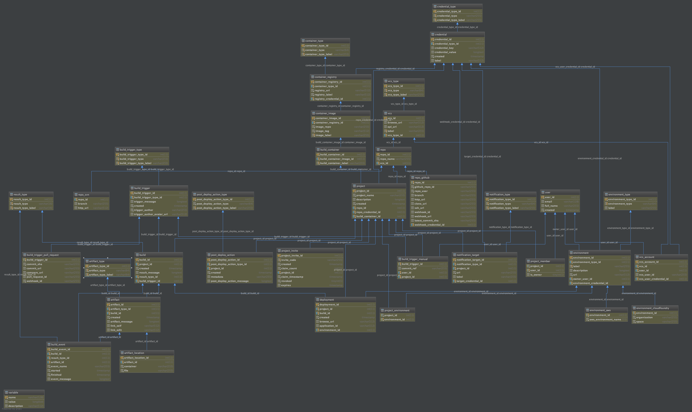

# Helion Code Engine : Schema V2
This is a temporary repo for discussion of the V2 version of the Helion CodeEngine database and REST API schema.

## Database
Load the associated [code_engine.sql](code_engine.sql) file into MySQL, or view the visualization diagram below:
