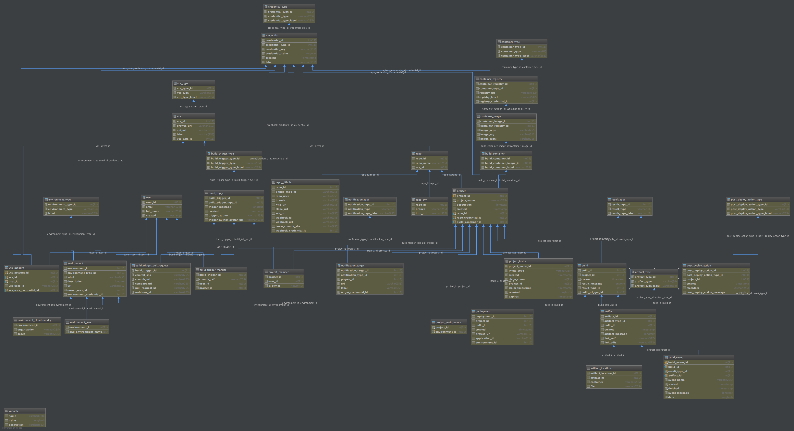

# Helion Code Engine : Schema V2
This is a temporary repo for discussion of the V2 version of the Helion CodeEngine database and REST API schema.

## Database
Load the associated [code_engine.sql](code_engine.sql) file into MySQL, or view the visualization diagram below:

## Notes & issues

* Post-deploy actions: No promises made about the accuracy of this section of the API or DB schema. Need to consult with team.
    * StormRunner stuff has not been addressed/generalized at all.
* Artifacts is also up in the air... do we really need to be uploading artifacts via CREST? Similarly with downloads. Need to discuss.

* `project_invite`: We should really be generating unique per-user invitations.
   * Need to add API for this after we decide on invite policy

* Environments: What is the story with ownership of environments?
    * Do envs belong to a person (owner, or owners), or are they associated with a project.
    * Can all project members edit/update/delete a project?
    * Is there a N:M relationship between projects and envs?
    * Or should envs be associated with a project only via a deployment instance?

* For polymorphic objects, swagger-codegen doesn't generate the struct with fields in the swagger source order. Need to open a bug.

* Need to go through swagger and do hygiene:
   * Consistent use of snake_case (per GitHub, Twitter, Google, etc.)
   * Remove any old unused operations
   * Standardize error responses
